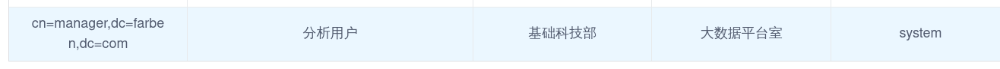
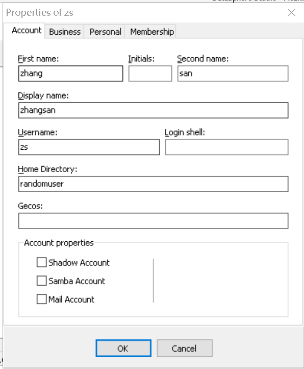
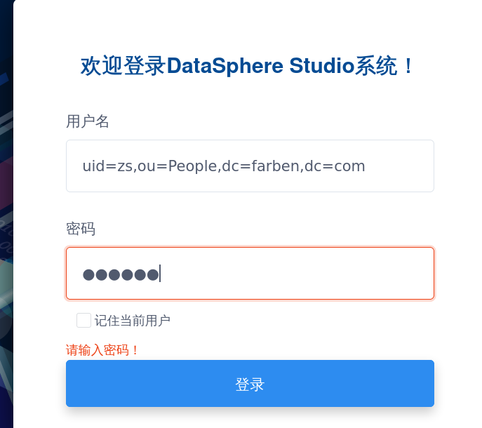
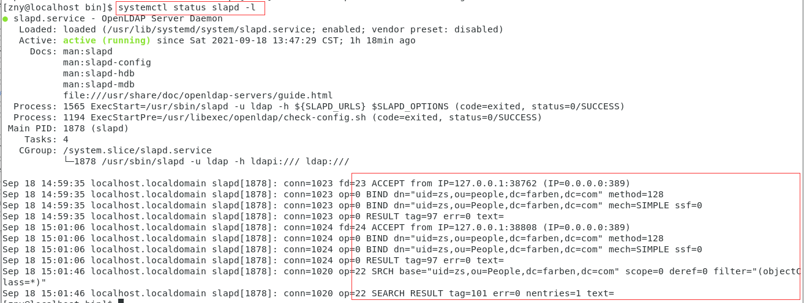

# DSS 1.0.0 + LDAP登录文档

**环境** 

```纯文本
CentOS Linux release 7.9.2009 (Core)

DSS1.0.0一键部署包

切换为root权限

```


**安装Openldap** 

```Bash
yum install -y openldap openldap-clients openldap-servers migrationtools openldap-devel compat-openldap
```


**配置Openldap的数据库DB_CONFIG** 

```Bash
cp /usr/share/openldap-servers/DB_CONFIG.example /var/lib/ldap/DB_CONFIG
chown ldap. /var/lib/ldap/DB_CONFIG

```


**启动openldap服务并设置开机自启动** 

```Bash
systemctl start slapd
systemctl enable slapd
```


**查看ldap状态** 

```Bash
systemctl status slapd -l

```


**设置ldap的管理员root密码并生成加密密码，这里使用123456** 

```Bash
[root@localhost sbin]# slappasswd -s 123456
{SSHA}X91Q6FY5MlR6KCaw/w626K//+99CxUY4
```


**新建一个rootpwd.ldif(名称可自定义)** 

```Bash
gedit rootpwd.ldif
#####
dn: olcDatabase={0}config,cn=config
changetype: modify
add: olcRootPW
olcRootPW: {SSHA}krOGXDmiCdSXuXocOf10F96LJO5ijdXo

```


**常见LDAP层级** 

| | | |
|---|---|---|
|**关键字** |**英文全称** |**含义** |
|**dc** |Domain Component|域名的部分，其格式是将完整的域名分成几部分，如域名为example.com变成dc=example,dc=com（一条记录的所属位置）|
|**uid** |User Id|用户ID San.Zhang（一条记录的ID）|
|**ou** |Organization Unit|组织单位，组织单位可以包含其他各种对象（包括其他组织单元），如“oa组”（一条记录的所属组织）|
|**cn** |Common Name|公共名称，如“Thomas Johansson”（一条记录的名称）|
|**sn** |Surname|姓，如“许”|
|**dn** |Distinguished Name|“uid=San.Zhang,ou=oa组,dc=example,dc=com”，一条记录的位置（唯一）|
|**rdn** |Relative dn|相对辨别名，类似于文件系统中的相对路径，它是与目录树结构无关的部分，如“uid=tom”或“cn= Thomas Johansson”|


**将上面的rootpwd.ldif文件写入LDAP** 

```Bash
[root@localhost ~] ldapadd -Y EXTERNAL -H ldapi:/// -f rootpwd.ldif
#SASL/EXTERNAL authentication started
#SASL username: gidNumber=0+uidNumber=0,cn=peercred,cn=external,cn=auth
#SASL SSF: 0
#modifying entry "olcDatabase={0}config,cn=config"

```


**导入Schema，schema包含为了支持特殊场景相关的属性，可根据选择导入，这里选择全部导入** 

```Bash
ls /etc/openldap/schema/*.ldif | while read f; do ldapadd -Y EXTERNAL -H ldapi:/// -f $f; done

```


**设定默认域** 

```Bash
先使用slappasswd生成一个密码:654321
slappasswd
New password:
Re-enter new password:
{SSHA}PofNdkchMXm8Mapv8SWqKJ42wuSGJcXN

```


**新建一个domain.ldif文件** 

```Bash
dn: olcDatabase={1}monitor,cn=config
changetype: modify
replace: olcAccess
olcAccess: {0}to * by dn.base="gidNumber=0+uidNumber=0,cn=peercred,cn=external,cn=auth" read by dn.base="cn=Manager,dc=farben,dc=com" read by * none

dn: olcDatabase={2}hdb,cn=config
changetype: modify
replace: olcSuffix
olcSuffix: dc=farben,dc=com

dn: olcDatabase={2}hdb,cn=config
changetype: modify
replace: olcRootDN
olcRootDN: cn=Manager,dc=farben,dc=com

dn: olcDatabase={2}hdb,cn=config
changetype: modify
add: olcRootPW
olcRootPW: {SSHA}PofNdkchMXm8Mapv8SWqKJ42wuSGJcXN #替换上面生成的密码

dn: olcDatabase={2}hdb,cn=config
changetype: modify
add: olcAccess
olcAccess: {0}to attrs=userPassword,shadowLastChange by
  dn="cn=Manager,dc=farben,dc=com" write by anonymous auth by self write by * none
olcAccess: {1}to dn.base="" by * read
olcAccess: {2}to * by dn="cn=Manager,dc=farben,dc=com" write by * read
```


**把doman.ldif写入ldap** 

```Bash
ldapmodify -Y EXTERNAL -H ldapi:/// -f domain.ldif

```


**添加基本目录，新建一个basedomain.ldif的文件<br />** 

```Bash
dn: dc=farben,dc=com
objectClass: top
objectClass: dcObject
objectclass: organization
o: farben com
dc: farben

dn: cn=Manager,dc=farben,dc=com
objectClass: organizationalRole
cn: Manager
description: Directory Manager

dn: ou=People,dc=farben,dc=com
objectClass: organizationalUnit
ou: People

dn: ou=Group,dc=farben,dc=com
objectClass: organizationalUnit
ou: Group
```


- DC即Domain Component，LDAP目录类似文件系统目录dc=farben,dc=com相当于/com/farben

- CN即Common Name，CN有可能代表一个用户名，例如cn=Manager,dc=farben,dc=com表示在/com/farben域下的管理员用户Manager

- OU即Organizational Unit，例如ou=People,dc=farben,dc=com表示在/com/farben域下的一个组织单元People


**写入basedomain.ldif到ldap服务器** 

```Bash
ldapadd -x -D cn=Manager,dc=farben,dc=com -W -f basedomain.ldif
Enter LDAP Password: (654321)
adding new entry "dc=farben,dc=com"

adding new entry "cn=Manager,dc=farben,dc=com"

adding new entry "ou=People,dc=farben,dc=com"

adding new entry "ou=Group,dc=farben,dc=com"

```


**测试LDAP服务** 

```Bash
ldapsearch -LLL -W -x -D "cn=Manager,dc=farben,dc=com" -H ldap://localhost -b "dc=farben,dc=com"

Enter LDAP Password: (654321)
dn: dc=farben,dc=com
objectClass: top
objectClass: dcObject
objectClass: organization
o: farben com
dc: farben

dn: cn=Manager,dc=farben,dc=com
objectClass: organizationalRole
cn: Manager
description: Directory Manager

dn: ou=People,dc=farben,dc=com
objectClass: organizationalUnit
ou: People

dn: ou=Group,dc=farben,dc=com
objectClass: organizationalUnit
ou: Group


```


**开放防火墙** 

```Bash
[root@localhost ~]# firewall-cmd --add-service=ldap --permanent
success
[root@localhost ~]# firewall-cmd --reload
success

```


**在局域网内的windows电脑上下载** [ldapadmin](http://www.ldapadmin.org/download/ldapadmin.html)**作为LDAP GUI管理工具** 


**配置DSS LDAP登录** 

修改linkis/conf/linkis-mg-gateway.properties文件

```Bash
##LDAP 
wds.linkis.ldap.proxy.url=ldap://127.0.0.1:389/
wds.linkis.ldap.proxy.baseDN=dc=farben,dc=com
```


**重启dss服务以支持LDAP** 


由于DSS & Linkis做了自上而下的多租户隔离，为了使登录的用户可正常使用DSS，还需在linux服务器上面创建对应的Linux用户，具体步骤如下：  

1.在所有Linkis & DSS 服务器上创建对应Linux用户。  

2.在Hadoop的NameNode创建对应Linux用户。  

3.保证Linkis & DSS 服务器上的Linux用户，可正常使用hdfs dfs -ls /等命令，同时该用户需要能正常使用Spark和hive任务， 如：通过spark-sql命令可以启动一个spark application，通过hive命令可以启动一个hive客户端。  

4.由于每个用户的工作空间严格隔离，您还需为该用户创建工作空间和HDFS目录，如下：

```Bash
 # 创建用户工作空间目录
    mkdir $WORKSPACE_USER_ROOT_PATH/${NEW_USER}
    chmod 750 $WORKSPACE_USER_ROOT_PATH/${NEW_USER}

    # 创建用户HDFS目录
    hdfs dfs -mkdir $HDFS_USER_ROOT_PATH/${NEW_USER}
    hdfs dfs -chmod 750 $HDFS_USER_ROOT_PATH/${NEW_USER}
```


WORKSPACE_USER_ROOT_PATH和HDFS_USER_ROOT_PATH是一键安装DSS时，设置的工作空间和HDFS根路径。  

如果没有设置，则默认为：  

WORKSPACE_USER_ROOT_PATH=file:///tmp/linkis  

HDFS_USER_ROOT_PATH=hdfs:///tmp/linkis

此处LDAP登录案例为：

```Bash
 # 创建用户工作空间目录
    mkdir ///tmp/linkis/cn=manager,dc=farben,dc=com 
    chmod 750 ///tmp/linkis/cn=manager,dc=farben,dc=com

    # 创建用户HDFS目录
    hdfs dfs -mkdir ///tmp/linkis/cn=manager,dc=farben,dc=com
    hdfs dfs -chmod 750 ///tmp/linkis/cn=manager,dc=farben,dc=com
```


**此时，LDAP途径登录的用户可以正常执行工作，同时自动被加入工作空间内的分析用户** 





**添加新的LDAP用户uid=zs（密码为000000）** 






**监测服务器是否有收到来自DSS的登录请求** 




参考：

[http://cnblogs.com](http://cnblogs.com)

[http://linuxprobe.com](http://linuxprobe.com)


